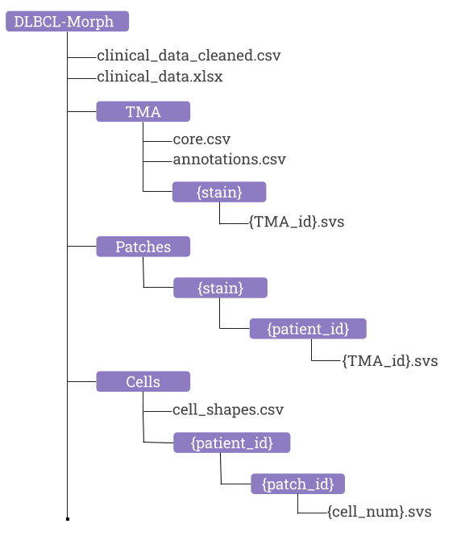

# DLBCL-Morph: Morphological features computed using deep learning for an annotated digital DLBCL image set 

DLBCL-Morph is a dataset containing 42 digitally scanned high-resolution tissue microarray (TMA) slides accompanied by clinical, cytogenetic, and geometric features from 209 DLBCL cases as described in ["DLBCL-Morph: Morphological features computed using deep learning for an annotated digital DLBCL image set"](...).  

### Abstract
Diffuse Large B-Cell Lymphoma (DLBCL) is the most common non-Hodgkin lymphoma. Though histologically DLBCL shows varying morphologies, no morphologic features have been consistently demonstrated to correlate with prognosis. We present a morphologic analysis of histology sections from 209 DLBCL cases with associated clinical and cytogenetic data. Duplicate tissue core sections were arranged in tissue microarrays (TMAs), and replicate sections were stained with H\&E and immunohistochemical stains for CD10, BCL6, MUM1, BCL2, and MYC. The TMAs are accompanied by pathologist-annotated regions-of-interest (ROIs) that identify areas of tissue representative of DLBCL. We used a deep learning model to segment all tumor nuclei in the ROIs, and computed several geometric features for each segmented nucleus. We fit a Cox proportional hazards model to demonstrate the utility of these geometric features in predicting survival outcome, and found that it achieved a C-index (95\% CI) of 0.635 (0.574,0.691). Our finding suggests that geometric features computed from tumor nuclei is of prognostic importance, and should be validated in prospective studies.

## Code Usage
Below we walk through the code files in this repo.

### Cleaning Clinial Data
The [data\_cleaner.py](https://github.com/stanfordmlgroup/DLBCL-Morph/blob/master/scripts/data_cleaner.py) is used to create `clinical_data_cleaned.csv` from `clinical_data.xlsx`. 

### Patch extractor
The notebook [extract\_patches.ipynb](https://github.com/stanfordmlgroup/DLBCL-Morph/blob/master/notebooks/extract_patches.ipynb) shows how patches were extracted from the TMAs inside the ROIs. 

### Visualizing Geometric Features
The notebook [visualize\_geometric\_features.ipynb](https://github.com/stanfordmlgroup/DLBCL-Morph/blob/master/notebooks/visualize_geometric_features.ipynb) illustrates the fitting of a rectangle and an ellipse to any tumor nucleus, and computation of associated geometric features.

### Survival Regression
The notebook [survival\_regression.ipynb](https://github.com/stanfordmlgroup/DLBCL-Morph/blob/master/notebooks/survival_regression.ipynb) reproduces the Cox model results in our paper.

### Computing All Geometric Features
The scripts [derive\_shape\_factor\_matlb.py](https://github.com/stanfordmlgroup/DLBCL-Morph/blob/master/scripts/derive_shape_factor_matlb.py) and [extract\_res.m](https://github.com/stanfordmlgroup/DLBCL-Morph/blob/master/scripts/extract_res.m) computes all the geometric features that can be found in `cell_shapes.csv`. Matlab is required to run these scripts.
